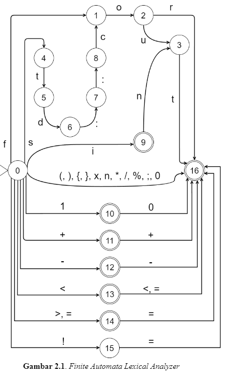

# C++ For Loop Lexical Analyzer and Parser

## How to run the program

Run on local web browser:
access this website => https://veroes.github.io/cpp-forloop-lexical-parser/

Run on local machine:

1. git clone this repo or download as zip file
2. open repo directory
3. open index.html (recommend with live server vsc extension or nodejs)
4. input C++ For Loop syntax

## Grammar

[statement] ::= for ([initialization]; [condition]; [increment_decrement]) {[action]}

[initialization] ::= [variable] | int [variable] = [number]

[condition] ::= [variable] [comparator] [number] | [variable] [comparator] [variable]

[increment_decrement] ::= [variable]++ | [variable]--

[action] ::= std::cout << [variable]

[variable] ::= i | n | x

[number] ::= 0 | 1 | 10

[comparator] ::= == | != | > | >= | < | <=

[operator] ::= + | - | \* | / | %

## Non-Terminal Symbol

[statement], [initialization], [condition], [increment_decrement],
[action], [variable], [number], [comparator], [operator]

## Terminal Symbol

for, (, ), {, }, ;, ++, –, std::cout, <<, =, i, n, x, 0, 1, 10, ==, !=, >, >=, < , <=, +, \*, /, %

